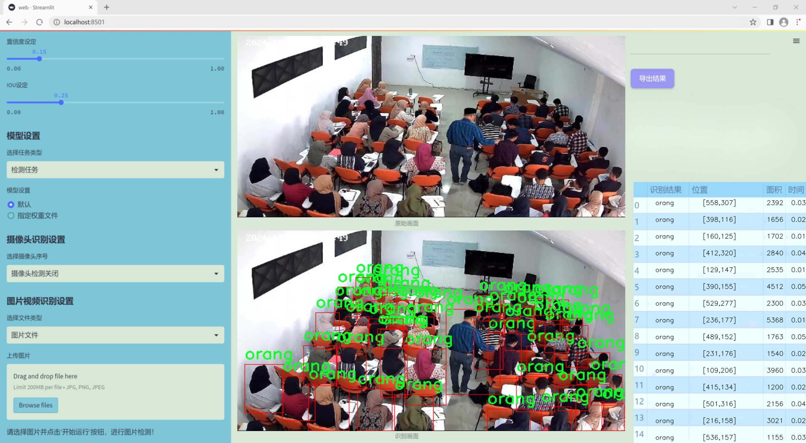
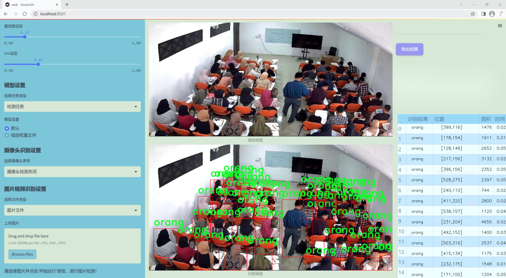
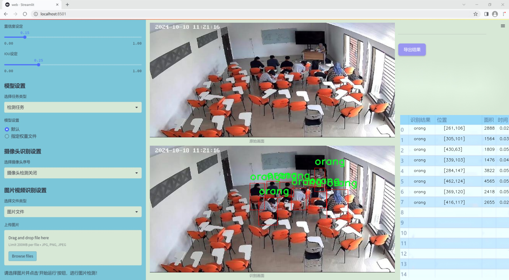
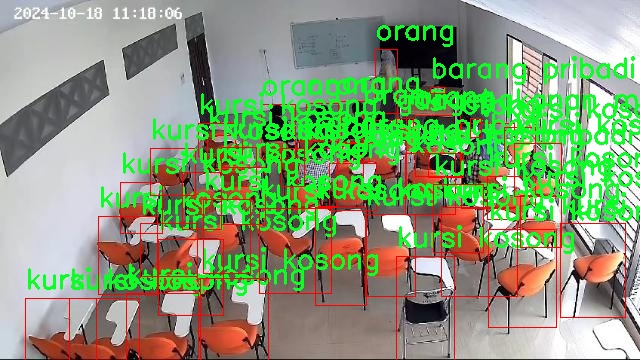
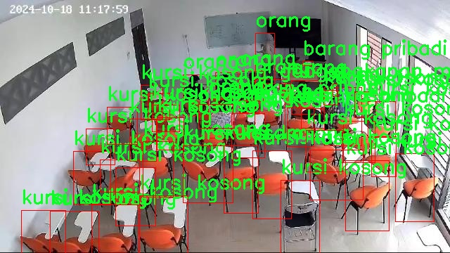

### 1.背景意义

研究背景与意义

随着教育信息化的不断推进，课堂管理的智能化成为提升教学质量和效率的重要手段。课堂场景中的物体检测技术，尤其是基于深度学习的目标检测算法，能够有效识别和分析课堂环境中的各种物体，为教育管理提供数据支持。近年来，YOLO（You Only Look Once）系列算法因其高效的实时检测能力和较好的精度，逐渐成为物体检测领域的主流选择。YOLOv11作为该系列的最新版本，结合了更先进的网络结构和优化算法，能够在复杂的场景中实现更高的检测精度和速度。

本研究旨在基于改进的YOLOv11算法，构建一个课堂场景物体检测系统，重点识别学生到课率。通过对课堂环境中五类物体的检测，包括个人物品（barang pribadi）、电子设备（gadget）、空座位（kursi kosong）、食品饮料（makanan minuman）和学生（orang），系统能够实时监测课堂的出勤情况。该系统的核心在于利用高效的图像处理和深度学习技术，自动识别和统计到课学生的数量，从而为教师和管理者提供科学的决策依据。

数据集的构建是本研究的重要基础。我们使用了包含999张图像的数据集，这些图像经过精心标注，涵盖了课堂场景中的多种物体。通过对这些数据的训练，改进的YOLOv11模型将能够更准确地识别出课堂中的学生和其他物体，进而提高到课率的识别准确性。该系统不仅可以减轻教师的管理负担，还能为教育研究提供丰富的数据支持，推动教育管理的智能化发展。

综上所述，基于改进YOLOv11的课堂场景物体检测学生到课率识别系统，具有重要的理论价值和实际应用意义。它不仅为课堂管理提供了新的技术手段，也为未来教育领域的智能化发展奠定了基础。

### 2.视频效果

[2.1 视频效果](https://www.bilibili.com/video/BV1onUGYoEju/)

### 3.图片效果







##### [项目涉及的源码数据来源链接](https://kdocs.cn/l/cszuIiCKVNis)**

注意：本项目提供训练的数据集和训练教程,由于版本持续更新,暂不提供权重文件（best.pt）,请按照6.训练教程进行训练后实现上图演示的效果。

### 4.数据集信息

##### 4.1 本项目数据集类别数＆类别名

nc: 5
names: ['barang pribadi', 'gadget', 'kursi kosong', 'makanan minuman', 'orang']


该项目为【目标检测】数据集，请在【训练教程和Web端加载模型教程（第三步）】这一步的时候按照【目标检测】部分的教程来训练

##### 4.2 本项目数据集信息介绍

本项目数据集信息介绍

本项目旨在改进YOLOv11的课堂场景物体检测系统，以实现对学生到课率的精准识别。为此，我们构建了一个专门的数据集，主题为“CCTV 1”，该数据集专注于课堂环境中的各种物体识别。数据集中包含五个主要类别，分别是“barang pribadi”（个人物品）、“gadget”（电子设备）、“kursi kosong”（空椅子）、“makanan minuman”（食品饮料）和“orang”（人）。这些类别的选择不仅反映了课堂环境的实际情况，也为模型的训练提供了丰富的样本。

在数据集的构建过程中，我们收集了大量来自不同课堂场景的图像，这些图像通过CCTV监控设备捕捉，确保了数据的真实性和多样性。每个类别的样本数量经过精心设计，以保证模型在训练过程中能够充分学习到每种物体的特征。通过对这些图像进行标注，我们为每个类别提供了详细的边界框信息，使得YOLOv11能够在训练过程中有效地学习到如何识别和区分这些物体。

此外，数据集还考虑到了不同时间段和不同环境条件下的变化，确保模型在实际应用中具有良好的鲁棒性。例如，课堂上可能出现的不同光照条件、学生的不同坐姿以及物品的摆放位置等，都被纳入了数据集的考虑范围。这种多样性不仅提高了模型的泛化能力，也为后续的性能评估提供了可靠的基础。

通过这一数据集的训练，我们期望能够显著提升YOLOv11在课堂场景中的物体检测精度，从而为学生到课率的识别提供更为准确的数据支持，最终实现对课堂管理的智能化和数据化。






### 5.全套项目环境部署视频教程（零基础手把手教学）

[5.1 所需软件PyCharm和Anaconda安装教程（第一步）](https://www.bilibili.com/video/BV1BoC1YCEKi/?spm_id_from=333.999.0.0&vd_source=bc9aec86d164b67a7004b996143742dc)


[5.2 安装Python虚拟环境创建和依赖库安装视频教程（第二步）](https://www.bilibili.com/video/BV1ZoC1YCEBw?spm_id_from=333.788.videopod.sections&vd_source=bc9aec86d164b67a7004b996143742dc)

### 6.改进YOLOv11训练教程和Web_UI前端加载模型教程（零基础手把手教学）

[6.1 改进YOLOv11训练教程和Web_UI前端加载模型教程（第三步）](https://www.bilibili.com/video/BV1BoC1YCEhR?spm_id_from=333.788.videopod.sections&vd_source=bc9aec86d164b67a7004b996143742dc)


按照上面的训练视频教程链接加载项目提供的数据集，运行train.py即可开始训练



     Epoch   gpu_mem       box       obj       cls    labels  img_size
     1/200     20.8G   0.01576   0.01955  0.007536        22      1280: 100%|██████████| 849/849 [14:42<00:00,  1.04s/it]
               Class     Images     Labels          P          R     mAP@.5 mAP@.5:.95: 100%|██████████| 213/213 [01:14<00:00,  2.87it/s]
                 all       3395      17314      0.994      0.957      0.0957      0.0843

     Epoch   gpu_mem       box       obj       cls    labels  img_size
     2/200     20.8G   0.01578   0.01923  0.007006        22      1280: 100%|██████████| 849/849 [14:44<00:00,  1.04s/it]
               Class     Images     Labels          P          R     mAP@.5 mAP@.5:.95: 100%|██████████| 213/213 [01:12<00:00,  2.95it/s]
                 all       3395      17314      0.996      0.956      0.0957      0.0845

     Epoch   gpu_mem       box       obj       cls    labels  img_size
     3/200     20.8G   0.01561    0.0191  0.006895        27      1280: 100%|██████████| 849/849 [10:56<00:00,  1.29it/s]
               Class     Images     Labels          P          R     mAP@.5 mAP@.5:.95: 100%|███████   | 187/213 [00:52<00:00,  4.04it/s]
                 all       3395      17314      0.996      0.957      0.0957      0.0845


###### [项目数据集下载链接](https://kdocs.cn/l/cszuIiCKVNis)

### 7.原始YOLOv11算法讲解

YOLO11采用改进的骨干和颈部架构，增强了特征提取能力，提高了物体检测的精确度和复杂任务的表现。YOLO11引入精炼的架构设计和优化的训练流程，实现更快的处理速度，同时保持精度和性能之间的最佳平衡。通过模型设计的进步，YOLO11m在COCO数据集上实现了更高的均值平均精度（mAP），同时使用比YOLOv8m少22%的参数，使其在不妥协准确性的情况下更加计算高效。YOLO11可以无缝部署在各种环境中，包括边缘设备、云平台以及支持NVIDIA
GPU的系统，确保最大灵活性。无论是物体检测、实例分割、图像分类、姿态估计，还是定向物体检测（OBB），YOLO11都旨在应对多样的计算机视觉挑战。


##### **Ultralytics YOLO11相比于之前版本的主要改进有哪些？**

Ultralytics YOLO11在其前身基础上引入了几项重要进步。主要改进包括：

  1. **增强的特征提取** ：YOLO11采用改进的骨干和颈部架构，增强了特征提取能力，提高了物体检测的精确度。
  2.  **优化的效率和速度** ：精炼的架构设计和优化的训练流程实现了更快的处理速度，同时保持了准确性和性能之间的平衡。
  3.  **更高的准确性与更少的参数** ：YOLO11m在COCO数据集上实现了更高的均值平均精度（mAP），同时使用比YOLOv8m少22%的参数，使其在不妥协准确性的情况下更加计算高效。
  4.  **环境适应性强** ：YOLO11可以在多种环境中部署，包括边缘设备、云平台以及支持NVIDIA GPU的系统。
  5.  **支持广泛的任务** ：YOLO11支持多种计算机视觉任务，如物体检测、实例分割、图像分类、姿态估计和定向物体检测（OBB）。

我们先来看一下其网络结构有什么变化，可以看出，相比较于YOLOv8模型，其将CF2模块改成C3K2，同时在SPPF模块后面添加了一个C2PSA模块，且将YOLOv10的head思想引入到YOLO11的head中，使用深度可分离的方法，减少冗余计算，提高效率。下面我们来详细看一下这两个模块的结构是怎么构成的，以及它们为什么要这样设计


##### C3K2的网络结构

从下面图中我们可以看到，C3K2模块其实就是C2F模块转变出来的，它代码中有一个设置，就是当c3k这个参数为FALSE的时候，C3K2模块就是C2F模块，也就是说它的Bottleneck是普通的Bottleneck；反之当它为true的时候，将Bottleneck模块替换成C3模块。


##### C2PSA的网络结构

` `C2PSA是对 `C2f` 模块的扩展，它结合了PSA(Pointwise Spatial
Attention)块，用于增强特征提取和注意力机制。通过在标准 `C2f` 模块中引入 PSA
块，C2PSA实现了更强大的注意力机制，从而提高了模型对重要特征的捕捉能力。


##### **C2f 模块回顾：**

**** C2f模块是一个更快的 CSP（Cross Stage Partial）瓶颈实现，它通过两个卷积层和多个 Bottleneck
块进行特征提取。相比传统的 CSPNet，C2f 优化了瓶颈层的结构，使得计算速度更快。在 C2f中，`cv1` 是第一个 1x1
卷积，用于减少通道数；`cv2` 是另一个 1x1 卷积，用于恢复输出通道数。而 `n` 是一个包含 Bottleneck 块的数量，用于提取特征。

##### **C2PSA 模块的增强** ：

**C2PSA** 扩展了 C2f，通过引入PSA( **Position-Sensitive Attention)**
，旨在通过多头注意力机制和前馈神经网络来增强特征提取能力。它可以选择性地添加残差结构（shortcut）以优化梯度传播和网络训练效果。同时，使用FFN
可以将输入特征映射到更高维的空间，捕获输入特征的复杂非线性关系，允许模型学习更丰富的特征表示。

##### head部分

YOLO11在head部分的cls分支上使用深度可分离卷积 ，具体代码如下，cv2边界框回归分支，cv3分类分支。

    
    
     self.cv2 = nn.ModuleList(
                nn.Sequential(Conv(x, c2, 3), Conv(c2, c2, 3), nn.Conv2d(c2, 4 * self.reg_max, 1)) for x in ch
            )
            self.cv3 = nn.ModuleList(
                nn.Sequential(
                    nn.Sequential(DWConv(x, x, 3), Conv(x, c3, 1)),
                    nn.Sequential(DWConv(c3, c3, 3), Conv(c3, c3, 1)),
                    nn.Conv2d(c3, self.nc, 1),
                )
                for x in ch
            )


### 8.200+种全套改进YOLOV11创新点原理讲解

#### 8.1 200+种全套改进YOLOV11创新点原理讲解大全

由于篇幅限制，每个创新点的具体原理讲解就不全部展开，具体见下列网址中的改进模块对应项目的技术原理博客网址【Blog】（创新点均为模块化搭建，原理适配YOLOv5~YOLOv11等各种版本）

[改进模块技术原理博客【Blog】网址链接](https://gitee.com/qunmasj/good)


#### 8.2 精选部分改进YOLOV11创新点原理讲解

###### 这里节选部分改进创新点展开原理讲解(完整的改进原理见上图和[改进模块技术原理博客链接](https://gitee.com/qunmasj/good)【如果此小节的图加载失败可以通过CSDN或者Github搜索该博客的标题访问原始博客，原始博客图片显示正常】

### ParC融合位置感知循环卷积简介
ParC：Position aware circular convolution


#### Position aware circular convolution
针对于全局信息的提取作者提出了Position aware circular convolution（也称作Global Circular Convolution）。图中左右实际是对于该操作水平竖直两方向的对称，理解时只看左边即可。对于维度为C*H*W的输入，作者先将维度为C*B*1的Position Embedding通过双线性插值函数F调整到适合input的维度C*H*1（以适应不同特征大小输入），并且将PE水平复制扩展到C*H*W维度与输入特征相加。这里作者将PE直接设置成为了可学习的参数。

接下来参考该博客将加入PE的特征图竖直方向堆叠，并且同样以插值的方式得到了适应输入维度的C*H*1大小的卷积核，进行卷积操作。对于这一步卷积，作者将之称为循环卷积，并给出了一个卷积示意图。


但个人感觉实际上这个示意图只是为了说明为什么叫循环卷积，对于具体的计算细节还是根据公式理解更好。


进一步，作者给出了这一步的伪代码来便于读者对这一卷积的理解：y=F.conv2D（torch.cat（xp，xp，dim=2），kV），实际上就是将xp堆叠之后使用了一个“条形（或柱形）”卷积核进行简单的卷积操作。（但这样会导致多一次重复卷积，因此在堆叠示意图中只取了前2*H-1行）

可以看到在示意图中特征维度变化如下：C*(2H-1)*W ---C*H*1--->C*H*W，作者特意带上了通道数，并且并没有出现通道数的改变，那么这里所进行的卷积应该是depth wise卷积，通过对文章后续以及论文源码的阅读可以得知这一步进行的就是DW卷积。（we introduce group convolution and point wise convolution into these modules, which decreases number of parameters without hurting performance.）


由groups = channel可知使用的是DW卷积
通过上面就完成了一次竖直方向的全局信息交流，同样只要在水平方向进行同样的操作即可做到水平方向的全局信息交流。

#### ParC block

通过ParC成功解决了全局信息提取的问题，接下来就是针对2）3）两点进行改进。首先是Meta-Former模块，Meta-Former由Token Mixer和Channel Mixer构成，ParC首先满足了Token Mixer的全局信息提取的要求，并且相较于Attention在计算成本上更低。


这里①中的PWC即point wise conv，进一步验证了我们前面对于深度可分离卷积的想法，而GCC-H/V即是前面所说的ParC-H/V。

①构建了Meta-Former中的Token mixer模块，那么最后剩下的问题就是3），替换掉Attention模块之后模型不再data driven。为了解决这一点作者给出了一个channel wise attention，先将特征图（x,C*H*W）进行global average（a,C*1*1）并输入一个MLP生成一个channel wise的权重（w,C*1*1），再将权重与特征图在通道方向相乘得到输出（output = wx,C*H*W）。

#### ParC net
对于ParC net 的搭建，作者直接基于MobileViT，采用了分叉结构（c）完成了网络的搭建。


具体而言作者保留了MobileViT中浅层具有局部感受野的MobileNetV2结构，而将网络深层的ViT block替换成了ParC block，使网络变成了一个pure ConvNet。


### 9.系统功能展示

图9.1.系统支持检测结果表格显示

  图9.2.系统支持置信度和IOU阈值手动调节

  图9.3.系统支持自定义加载权重文件best.pt(需要你通过步骤5中训练获得)

  图9.4.系统支持摄像头实时识别

  图9.5.系统支持图片识别

  图9.6.系统支持视频识别

  图9.7.系统支持识别结果文件自动保存

  图9.8.系统支持Excel导出检测结果数据


### 10. YOLOv11核心改进源码讲解

#### 10.1 TransNext.py

以下是对给定代码的核心部分进行分析和详细注释的结果：

```python
try:
    # 尝试导入swattention模块和TransNext_cuda中的所有内容
    import swattention
    from ultralytics.nn.backbone.TransNeXt.TransNext_cuda import *
except ImportError as e:
    # 如果导入失败（可能是因为没有安装swattention或TransNext_cuda），则导入TransNext_native中的所有内容
    from ultralytics.nn.backbone.TransNeXt.TransNext_native import *
    pass
```

### 代码分析与注释

1. **导入模块的尝试**：
   - `try:` 语句块用于尝试执行一段代码，如果该代码抛出异常，则会跳转到 `except` 语句块。
   - `import swattention`：尝试导入名为 `swattention` 的模块。这可能是一个自定义的或第三方的库，提供了一些功能。
   - `from ultralytics.nn.backbone.TransNeXt.TransNext_cuda import *`：尝试从 `ultralytics` 库的 `TransNeXt` 模块中导入所有内容，特别是与 CUDA 相关的实现。这通常用于加速深度学习模型的训练和推理。

2. **异常处理**：
   - `except ImportError as e:`：捕获导入过程中可能发生的 `ImportError` 异常。如果 `swattention` 或 `TransNext_cuda` 模块未能成功导入，将执行以下代码。
   - `from ultralytics.nn.backbone.TransNeXt.TransNext_native import *`：如果导入失败，则从 `TransNext_native` 模块中导入所有内容。这个模块可能是 `TransNext_cuda` 的一个替代实现，通常是基于 CPU 的实现。

3. **`pass` 语句**：
   - `pass` 是一个空语句，表示在这里不执行任何操作。它在 `except` 块中用于占位，表明在捕获异常后不需要额外的处理。

### 核心逻辑总结
这段代码的核心逻辑是实现一个灵活的模块导入机制：首先尝试导入 CUDA 加速的实现，如果失败，则回退到一个更通用的实现。这种方式可以确保在不同的环境中都能找到合适的模块，从而提高代码的兼容性和稳定性。

这段代码是一个Python脚本，文件名为`TransNext.py`。首先，它尝试导入一个名为`swattention`的模块，并且从`ultralytics.nn.backbone.TransNeXt`路径下导入`TransNext_cuda`。这表明该代码可能与深度学习或计算机视觉相关，尤其是涉及到某种神经网络架构的实现。

如果在导入`swattention`模块或`TransNext_cuda`时发生`ImportError`（即模块未找到或无法导入），代码会捕获这个异常，并尝试导入`TransNext_native`。这种设计通常用于兼容性处理，意味着如果系统不支持CUDA（即不支持GPU加速），代码将退回到一个不依赖于CUDA的实现。

通过这种方式，程序可以在不同的环境中运行，确保即使在没有GPU的情况下也能正常工作。这种灵活性在深度学习应用中是非常重要的，因为不同的用户可能会在不同的硬件配置上运行代码。整体来看，这段代码展示了对模块导入的异常处理和对不同实现的兼容性考虑。

#### 10.2 CSwomTramsformer.py

以下是经过简化并添加详细中文注释的核心代码部分：

```python
import torch
import torch.nn as nn
import numpy as np

class Mlp(nn.Module):
    """多层感知机（MLP）模块"""
    def __init__(self, in_features, hidden_features=None, out_features=None, act_layer=nn.GELU, drop=0.):
        super().__init__()
        out_features = out_features or in_features  # 输出特征数
        hidden_features = hidden_features or in_features  # 隐藏层特征数
        self.fc1 = nn.Linear(in_features, hidden_features)  # 第一层线性变换
        self.act = act_layer()  # 激活函数
        self.fc2 = nn.Linear(hidden_features, out_features)  # 第二层线性变换
        self.drop = nn.Dropout(drop)  # Dropout层

    def forward(self, x):
        """前向传播"""
        x = self.fc1(x)  # 线性变换
        x = self.act(x)  # 激活
        x = self.drop(x)  # Dropout
        x = self.fc2(x)  # 线性变换
        x = self.drop(x)  # Dropout
        return x

class CSWinBlock(nn.Module):
    """CSWin Transformer的基本块"""
    def __init__(self, dim, num_heads, mlp_ratio=4., drop=0., attn_drop=0., norm_layer=nn.LayerNorm):
        super().__init__()
        self.dim = dim  # 输入特征维度
        self.num_heads = num_heads  # 注意力头数
        self.mlp_ratio = mlp_ratio  # MLP的扩展比例
        self.norm1 = norm_layer(dim)  # 归一化层
        self.qkv = nn.Linear(dim, dim * 3)  # 线性变换生成Q、K、V

        # 注意力机制
        self.attn = LePEAttention(dim, num_heads=num_heads, attn_drop=attn_drop)

        # MLP模块
        mlp_hidden_dim = int(dim * mlp_ratio)  # 隐藏层维度
        self.mlp = Mlp(in_features=dim, hidden_features=mlp_hidden_dim, out_features=dim, drop=drop)
        self.norm2 = norm_layer(dim)  # 第二个归一化层

    def forward(self, x):
        """前向传播"""
        x = self.norm1(x)  # 归一化
        qkv = self.qkv(x).reshape(x.shape[0], -1, 3, self.dim).permute(2, 0, 1, 3)  # 生成Q、K、V
        attn_output = self.attn(qkv)  # 注意力计算
        x = x + attn_output  # 残差连接
        x = x + self.mlp(self.norm2(x))  # MLP和残差连接
        return x

class CSWinTransformer(nn.Module):
    """CSWin Transformer模型"""
    def __init__(self, img_size=640, in_chans=3, num_classes=1000, embed_dim=96, depth=[2, 2, 6, 2], num_heads=12):
        super().__init__()
        self.num_classes = num_classes
        self.embed_dim = embed_dim  # 嵌入维度

        # 输入层
        self.stage1_conv_embed = nn.Sequential(
            nn.Conv2d(in_chans, embed_dim, kernel_size=7, stride=4, padding=2),
            nn.LayerNorm(embed_dim)
        )

        # Transformer的各个阶段
        self.stage1 = nn.ModuleList([CSWinBlock(embed_dim, num_heads) for _ in range(depth[0])])
        self.stage2 = nn.ModuleList([CSWinBlock(embed_dim * 2, num_heads) for _ in range(depth[1])])
        self.stage3 = nn.ModuleList([CSWinBlock(embed_dim * 4, num_heads) for _ in range(depth[2])])
        self.stage4 = nn.ModuleList([CSWinBlock(embed_dim * 8, num_heads) for _ in range(depth[3])])

    def forward(self, x):
        """前向传播"""
        x = self.stage1_conv_embed(x)  # 输入层处理
        for blk in self.stage1:
            x = blk(x)  # 第一阶段的Transformer块
        for blk in self.stage2:
            x = blk(x)  # 第二阶段的Transformer块
        for blk in self.stage3:
            x = blk(x)  # 第三阶段的Transformer块
        for blk in self.stage4:
            x = blk(x)  # 第四阶段的Transformer块
        return x

# 示例用法
if __name__ == '__main__':
    inputs = torch.randn((1, 3, 640, 640))  # 随机输入
    model = CSWinTransformer()  # 创建模型
    res = model(inputs)  # 前向传播
    print(res.size())  # 输出结果的尺寸
```

### 代码注释说明：
1. **Mlp类**：实现了一个多层感知机（MLP），包含两个线性层和一个激活函数，支持Dropout。
2. **CSWinBlock类**：实现了CSWin Transformer的基本构建块，包含注意力机制和MLP，支持残差连接。
3. **CSWinTransformer类**：构建了整个CSWin Transformer模型，包含多个阶段的Transformer块。
4. **forward方法**：定义了模型的前向传播过程，逐层处理输入数据。

以上代码保留了CSWin Transformer的核心结构，并提供了必要的注释以帮助理解。

这个程序文件实现了一个名为CSWin Transformer的视觉变换器模型，主要用于图像分类等计算机视觉任务。代码的结构包括多个类和函数，分别负责不同的功能模块。

首先，文件导入了必要的库，包括PyTorch和一些用于图像处理和模型构建的工具。接着，定义了几个重要的类。`Mlp`类实现了一个多层感知机（MLP），它包含两个线性层和一个激活函数，支持Dropout以防止过拟合。`LePEAttention`类实现了一种特殊的注意力机制，名为局部增强位置编码（LePE），该机制通过将输入图像划分为窗口来计算注意力，适用于处理高分辨率图像。

`CSWinBlock`类是CSWin Transformer的基本构建块，结合了注意力机制和MLP。它的构造函数中包含了多个参数，用于配置模型的维度、头数、分割大小等。`Merge_Block`类则用于在不同阶段合并特征图，使用卷积层进行下采样。

`CSWinTransformer`类是整个模型的核心，包含了多个阶段的构建，每个阶段由多个`CSWinBlock`组成。模型的输入通过卷积层进行初步处理，然后依次经过各个阶段，最后输出特征。模型的构造函数中也包含了对权重的初始化。

在文件的最后部分，定义了一些函数用于创建不同规模的CSWin Transformer模型（如CSWin_tiny、CSWin_small等），并提供了加载预训练权重的功能。主函数部分则演示了如何实例化这些模型并对随机生成的输入进行前向传播，输出各个阶段的特征图尺寸。

整体来看，这个程序文件实现了一个复杂的视觉变换器模型，利用了现代深度学习中的多种技术，如注意力机制、MLP、卷积层等，适用于高效处理图像数据。

#### 10.3 fadc.py

以下是经过简化并添加详细中文注释的核心代码部分：

```python
import torch
import torch.nn as nn
import torch.nn.functional as F

class OmniAttention(nn.Module):
    def __init__(self, in_planes, out_planes, kernel_size, groups=1, reduction=0.0625, kernel_num=4, min_channel=16):
        super(OmniAttention, self).__init__()
        # 计算注意力通道数
        attention_channel = max(int(in_planes * reduction), min_channel)
        self.kernel_size = kernel_size
        self.kernel_num = kernel_num
        self.temperature = 1.0  # 温度参数，用于调整注意力分布

        # 定义平均池化层
        self.avgpool = nn.AdaptiveAvgPool2d(1)
        # 定义全连接层
        self.fc = nn.Conv2d(in_planes, attention_channel, 1, bias=False)
        self.bn = nn.BatchNorm2d(attention_channel)  # 批归一化
        self.relu = nn.ReLU(inplace=True)  # ReLU激活函数

        # 定义通道注意力的全连接层
        self.channel_fc = nn.Conv2d(attention_channel, in_planes, 1, bias=True)

        # 根据输入和输出通道数决定是否使用过滤器注意力
        if in_planes == groups and in_planes == out_planes:  # 深度卷积
            self.func_filter = self.skip
        else:
            self.filter_fc = nn.Conv2d(attention_channel, out_planes, 1, bias=True)
            self.func_filter = self.get_filter_attention

        # 根据卷积核大小决定是否使用空间注意力
        if kernel_size == 1:  # 点卷积
            self.func_spatial = self.skip
        else:
            self.spatial_fc = nn.Conv2d(attention_channel, kernel_size * kernel_size, 1, bias=True)
            self.func_spatial = self.get_spatial_attention

        # 根据卷积核数量决定是否使用核注意力
        if kernel_num == 1:
            self.func_kernel = self.skip
        else:
            self.kernel_fc = nn.Conv2d(attention_channel, kernel_num, 1, bias=True)
            self.func_kernel = self.get_kernel_attention

        self._initialize_weights()  # 初始化权重

    def _initialize_weights(self):
        # 初始化卷积层和批归一化层的权重
        for m in self.modules():
            if isinstance(m, nn.Conv2d):
                nn.init.kaiming_normal_(m.weight, mode='fan_out', nonlinearity='relu')
                if m.bias is not None:
                    nn.init.constant_(m.bias, 0)
            if isinstance(m, nn.BatchNorm2d):
                nn.init.constant_(m.weight, 1)
                nn.init.constant_(m.bias, 0)

    @staticmethod
    def skip(_):
        return 1.0  # 跳过操作，返回1.0

    def get_channel_attention(self, x):
        # 计算通道注意力
        channel_attention = torch.sigmoid(self.channel_fc(x).view(x.size(0), -1, 1, 1) / self.temperature)
        return channel_attention

    def get_filter_attention(self, x):
        # 计算过滤器注意力
        filter_attention = torch.sigmoid(self.filter_fc(x).view(x.size(0), -1, 1, 1) / self.temperature)
        return filter_attention

    def get_spatial_attention(self, x):
        # 计算空间注意力
        spatial_attention = self.spatial_fc(x).view(x.size(0), 1, 1, 1, self.kernel_size, self.kernel_size)
        spatial_attention = torch.sigmoid(spatial_attention / self.temperature)
        return spatial_attention

    def get_kernel_attention(self, x):
        # 计算核注意力
        kernel_attention = self.kernel_fc(x).view(x.size(0), -1, 1, 1, 1, 1)
        kernel_attention = F.softmax(kernel_attention / self.temperature, dim=1)
        return kernel_attention

    def forward(self, x):
        # 前向传播
        x = self.avgpool(x)  # 平均池化
        x = self.fc(x)  # 全连接层
        x = self.bn(x)  # 批归一化
        x = self.relu(x)  # ReLU激活
        return self.func_channel(x), self.func_filter(x), self.func_spatial(x), self.func_kernel(x)  # 返回四种注意力

class AdaptiveDilatedConv(nn.Module):
    """自适应膨胀卷积类，封装了可调变形卷积层"""

    def __init__(self, in_channels, out_channels, kernel_size, stride=1, padding=0, dilation=1, groups=1, bias=True):
        super(AdaptiveDilatedConv, self).__init__()
        # 定义卷积层
        self.conv = nn.Conv2d(in_channels, out_channels, kernel_size, stride=stride, padding=padding, dilation=dilation, groups=groups, bias=bias)
        self.omni_attention = OmniAttention(in_planes=in_channels, out_planes=out_channels, kernel_size=kernel_size)  # 初始化注意力模块

    def forward(self, x):
        # 前向传播
        attention_weights = self.omni_attention(x)  # 计算注意力权重
        x = self.conv(x)  # 卷积操作
        return x * attention_weights  # 应用注意力权重
```

### 代码说明：
1. **OmniAttention 类**：实现了多种注意力机制，包括通道注意力、过滤器注意力、空间注意力和核注意力。通过全连接层和卷积层计算注意力权重，并在前向传播中应用这些权重。

2. **AdaptiveDilatedConv 类**：封装了一个自适应膨胀卷积层，结合了 `OmniAttention` 类来增强卷积操作的表达能力。通过计算注意力权重来调整卷积输出。

3. **前向传播**：在 `forward` 方法中，首先计算注意力权重，然后执行卷积操作，最后将卷积结果与注意力权重相乘，得到最终输出。

这段代码展示了如何结合注意力机制与卷积操作，以提高模型的表现能力。


#### 10.3 FreqFusion.py

以下是经过简化并注释的核心代码部分，主要集中在 `FreqFusion` 类及其相关方法上。代码中保留了必要的功能和结构，同时添加了详细的中文注释。

```python
import torch
import torch.nn as nn
import torch.nn.functional as F

class FreqFusion(nn.Module):
    def __init__(self, channels, scale_factor=1, lowpass_kernel=5, highpass_kernel=3, **kwargs):
        super().__init__()
        hr_channels, lr_channels = channels
        self.scale_factor = scale_factor
        self.lowpass_kernel = lowpass_kernel
        self.highpass_kernel = highpass_kernel
        
        # 压缩通道数
        self.compressed_channels = (hr_channels + lr_channels) // 8
        
        # 定义高频和低频特征的压缩卷积层
        self.hr_channel_compressor = nn.Conv2d(hr_channels, self.compressed_channels, 1)
        self.lr_channel_compressor = nn.Conv2d(lr_channels, self.compressed_channels, 1)
        
        # 定义低通和高通特征的编码器
        self.content_encoder = nn.Conv2d(
            self.compressed_channels,
            lowpass_kernel ** 2 * scale_factor * scale_factor,
            kernel_size=3,
            padding=1
        )
        
        self.content_encoder2 = nn.Conv2d(
            self.compressed_channels,
            highpass_kernel ** 2 * scale_factor * scale_factor,
            kernel_size=3,
            padding=1
        )
        
        self.init_weights()  # 初始化权重

    def init_weights(self):
        """初始化卷积层的权重"""
        for m in self.modules():
            if isinstance(m, nn.Conv2d):
                nn.init.xavier_uniform_(m.weight)  # 使用Xavier初始化
                if m.bias is not None:
                    nn.init.constant_(m.bias, 0)  # 偏置初始化为0

    def kernel_normalizer(self, mask, kernel):
        """对卷积核进行归一化处理"""
        mask = F.softmax(mask, dim=1)  # 对mask进行softmax归一化
        mask = mask / mask.sum(dim=(-1, -2), keepdims=True)  # 归一化
        return mask

    def forward(self, x):
        """前向传播"""
        hr_feat, lr_feat = x  # 获取高分辨率和低分辨率特征
        
        # 压缩特征
        compressed_hr_feat = self.hr_channel_compressor(hr_feat)
        compressed_lr_feat = self.lr_channel_compressor(lr_feat)
        
        # 生成低通和高通特征
        mask_lr = self.content_encoder(compressed_hr_feat) + self.content_encoder(compressed_lr_feat)
        mask_hr = self.content_encoder2(compressed_hr_feat) + self.content_encoder2(compressed_lr_feat)
        
        # 归一化mask
        mask_lr = self.kernel_normalizer(mask_lr, self.lowpass_kernel)
        mask_hr = self.kernel_normalizer(mask_hr, self.highpass_kernel)
        
        # 使用卷积进行特征融合
        lr_feat = F.conv2d(lr_feat, mask_lr)  # 低分辨率特征卷积
        hr_feat = F.conv2d(hr_feat, mask_hr)  # 高分辨率特征卷积
        
        return hr_feat + lr_feat  # 返回融合后的特征

# 示例使用
# freq_fusion = FreqFusion(channels=(64, 32))
# output = freq_fusion((high_res_tensor, low_res_tensor))
```

### 代码说明：
1. **FreqFusion 类**：这是一个用于特征融合的神经网络模块，主要用于处理高分辨率和低分辨率的图像特征。
2. **初始化方法 `__init__`**：定义了必要的卷积层和参数，包括高频和低频特征的压缩和编码。
3. **权重初始化 `init_weights`**：使用 Xavier 初始化方法来初始化卷积层的权重。
4. **卷积核归一化 `kernel_normalizer`**：对生成的卷积核进行归一化处理，以确保输出的概率分布。
5. **前向传播 `forward`**：执行特征融合的主要逻辑，首先压缩输入特征，然后生成低通和高通特征，最后将这些特征融合并返回。

通过这些注释，可以更好地理解代码的结构和功能。

这个程序文件 `FreqFusion.py` 实现了一个名为 `FreqFusion` 的深度学习模块，主要用于密集图像预测任务。它的核心思想是通过频率感知特征融合来提升图像的预测质量。以下是对代码的详细说明。

首先，程序导入了必要的库，包括 PyTorch 及其相关模块。它还尝试从 `mmcv` 库中导入一些操作，如果导入失败则忽略。接着，定义了一些初始化函数，例如 `normal_init` 和 `constant_init`，用于对神经网络层的权重和偏置进行初始化。

`resize` 函数用于调整输入张量的大小，支持多种插值模式，并在特定条件下发出警告。`hamming2D` 函数则生成二维 Hamming 窗，用于后续的频率处理。

接下来是 `FreqFusion` 类的定义。这个类继承自 `nn.Module`，其构造函数接受多个参数来配置模型的行为。主要参数包括通道数、缩放因子、低通和高通滤波器的核大小等。类内部定义了多个卷积层和一些其他组件，用于特征的压缩和编码。

在 `init_weights` 方法中，模型的各个卷积层被初始化，确保其权重在训练开始时具有合理的值。`kernel_normalizer` 方法用于对生成的掩码进行归一化处理，以确保其和为1。

`forward` 方法是模型的前向传播逻辑。它接收高分辨率和低分辨率的特征图，经过一系列的卷积和处理后，输出融合后的特征图。具体来说，模型通过对高分辨率和低分辨率特征进行压缩、编码、以及高低通滤波，生成适合于图像重建的特征。

`LocalSimGuidedSampler` 类实现了一个局部相似性引导的采样器，用于生成特征的偏移量。它通过计算输入特征的相似性来指导特征的重采样过程。这个类同样定义了多个卷积层和归一化层，用于处理输入特征。

最后，`compute_similarity` 函数用于计算输入张量中每个点与其周围点的余弦相似度，这对于特征的相似性分析和后续的采样过程至关重要。

整体而言，`FreqFusion.py` 文件实现了一个复杂的深度学习模块，结合了频率感知和特征融合的技术，旨在提高图像预测的精度和质量。通过对高低频特征的有效利用，该模型能够在密集图像预测任务中表现出色。

### 11.完整训练+Web前端界面+200+种全套创新点源码、数据集获取


# [下载链接：https://mbd.pub/o/bread/Z5WbmZ9w](https://mbd.pub/o/bread/Z5WbmZ9w)